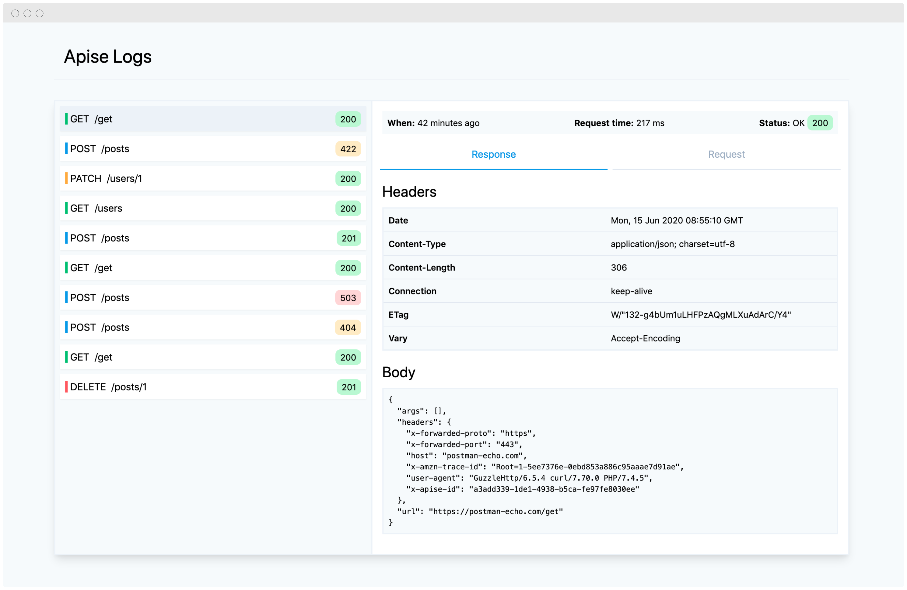

# Apise for Laravel

[](https://twitter.com/kielabokkie)
[](https://github.com/kielabokkie/laravel-apise/actions)
[](https://packagist.org/packages/kielabokkie/laravel-apise)
[](https://coveralls.io/github/kielabokkie/laravel-apise)
[](LICENSE.md)

Apise for Laravel can be used to simplify creating an API service for integrating with an external JSON API. It also comes with an optional UI to view request and response data of your API services.

<p align="center">
    
</p>

## Requirements

* PHP >= 7.2
* Laravel 5.8 | 6 | 7

## Installation

Install the package via composer:

```bash
composer require kielabokkie/laravel-apise
```

After the package is installed, you'll need to publish its assets:

```bash
php artisan apise:install
```

Run the migrations to setup the table used for logging:

```bash
php artisan migrate
```

### Updating Apise

When there is a new version of Apise always publish the assets with the command below to ensure you have the lastest Javascript and other assets.

```bash
php artisan vendor:publish --tag=apise-assets
```

## Package configuration

The configuration of the package can be found at `config/apise.php`. Below are the contents of the config file:

```php
return [
    /**
     * The namespace where your API Service classes are created under.
     * This will be appended to your base namespace. So the config below
     * will create a class under App\Support\Services.
     */
    'namespace' => 'Support\Services',

    /**
     * These middlewares will be assigned to the Apise routes. You can
     * add your own middleware to this list or change any of the existing
     * middleware.
     */
    'middleware' => [
        'web',
        Authorize::class,
    ],

    /**
     * Enable logging of requests and responses
     */
    'logging_enabled' => env('APISE_LOGGING_ENABLED', true),

    /**
     * Enable concealing of sensitive data
     */
    'conceal_enabled' => env('APISE_CONCEAL_ENABLED', true),

    /**
     * Keys that should be concealed when displayed on the Apise UI
     */
    'conceal_keys' => [
        'api_key'
    ]

    /**
     * This is the URI path where the UI will be accessible from
     */
    'path' => env('APISE_PATH', 'apise'),
];
```

### Logging

By default logging of all requests is enabled. This will give you a page under `/apise` where you can inspect request and response data. There will be some overhead when logging is enabled as records are saved to the database. To disable logging add the following to your `.env` file:

```
APISE_LOGGING_ENABLED=false
```

### Apise UI

As mentioned before the UI of Apise can be accessed via `/apise`. If you would like to change this you can do so by setting the following environment variable:

```
APISE_PATH='admin/apise'
```

### Conceal sensitive data

You probably don't want sensitive data to be stored in your database so Apise will make it easy for us to conceal this kind of data. In the background Apise uses the [kielabokie/laravel-conceal](https://github.com/kielabokkie/laravel-conceal) package to automatically conceal sensitive headers and request data. By default the package conceals the values of `password` and `password_confirmation` fields but you can add any keys you want to the `conceal_keys` array in the `apise.php` config file:

```php
'conceal_keys' => [
    'api_key',
    'Authorization',
    'token'
]
```

## Setup

To make use of the base API Client class you'll need to add the required `$baseUrl` to set the base URL of your API. You'll also have to call the `$this->setClient();` function in the constructor of your service class.

```php
<?php

namespace App\Support\Services;

use Kielabokkie\Apise\ApiseClient;

class HttpBinService extends ApiseClient
{
    protected $baseUrl = 'https://httpbin.org';

    public function __construct()
    {
        $this->setClient();
    }
}
```

To make it easy to get started you can use the following command to scaffold your API Service class:

```bash
php artisan make:api-service HttpBinService
```

This will create a class called `HttpBinService.php` in the `app/Support/Services` folder. All you have to do is set your `$baseUrl` and you are good to go.

Note: If you would like your classes to be placed somewhere else you can overwrite the `namespace` variable in the `apise.php` config file.

## Usage

### Get request

Now to execute a `GET` request you can simply do the following:

```php
public function getUsers()
{
    $response = $this->get('/users'));

    return json_decode($response->getBody());
}
```

This is pretty basic stuff and the same as you would normally do a `GET` request with Guzzle.

### Adding default headers

APIs often require you to add a specific header to every request, for example for authorisation purposes. Instead of having to pass that as an option with every request you can add the following function at the top of your service class:

```php
protected function defaultHeaders()
{
    return [
        'Authorization' => 'Bearer abcdef123456',
    ];
}
```

### Adding default query parameters

You can add default query parameters to every request automatically in a similar way:

```php
protected function defaultQueryParams()
{
    return [
        'token' => 'your-token'
    ];
}
```

This will automatically append the token as a get parameter like so: `https://httpbin.org/get?token=your-token`.

## Purge logs

Depending on how many calls your API service is doing the logs table can quickly fill up. You can run the prune command to remove any logs older than the given number of hours:

```bash
php artisan apise:prune --hours 24
```

To automatically prune old logs you can add it to the Laravel scheduler `app/Console/Kernel.php`, for example:

```php
protected function schedule(Schedule $schedule)
{
    // Clean up logs older than 3 days
    $schedule->command('apise:prune --hours=72')
         ->daily();
}
```

## Credits

This package borrowed a lot of its general structure from the [laravel/telescope](https://github.com/laravel/telescope) package. All credit goes to the original authors.

## Development

When working on the view that shows the logs you can run the Webpack dev server:

```
npm run hot
```

This will run the dev server on http://127.0.0.1:8080 with hot reload enabled.
